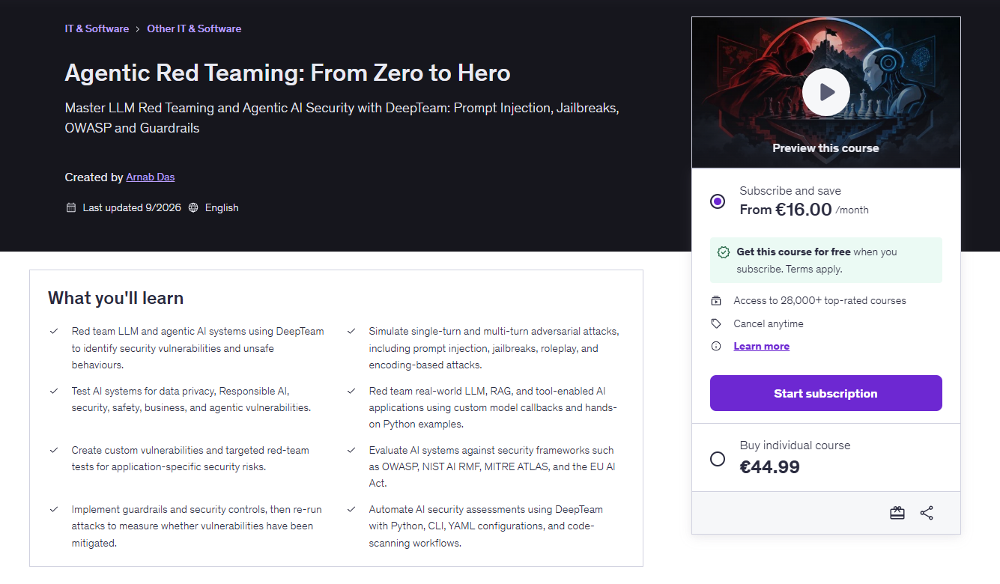

<h1 align="center">
  <a href="https://www.udemy.com/course/agentic-red-teaming-from-zero-to-hero/?referralCode=A014907592D3C1597861">
    Agentic Red Teaming: From Zero to Hero
  </a>
</h1>

<p align="center">
  Master LLM Red Teaming and Agentic AI Security with DeepTeam: Prompt Injection, Jailbreaks, OWASP and Guardrails
</p>

<p align="center">
  
</p> 


## Introduction

<b>DeepTeam</b> is an open-source framework to red team LLM systems. DeepTeam makes it extremely easy to incorporate the latest security guidelines and research to detect risks and vulnerabilities for LLMs, and was built with the following principles in mind:

- Easily "penetration test" LLM applications to detect 40+ security vulnerabilities and safety risks.
- Detect vulnerabilities such as bias, misinformation, PII leakage, over-reliance on context, and harmful content generation.
- Simulate adversarial attacks using 10+ methods including jailbreaking, prompt injection, automated evasion, data extraction, and response manipulation.
- Customize security assessments to align with OWASP Top 10 for LLMs, NIST AI Risk Management, and industry best practices.


### Installation

```sh
pip install -U deepteam
```
<p>Want to share risk assessments with your team, or a place for your test cases
to live?</p>

```
deepteam login
```

want to run config.yaml file ?

```sh
deepteam run config.yaml
```

### code Scanning 

```sh
deepteam scan .
```